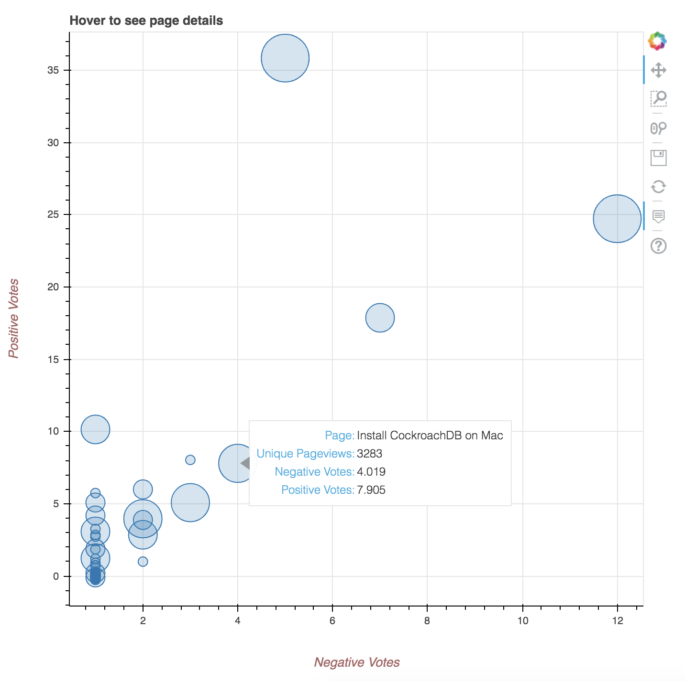

# Docs Analytics

This repository contains code for requesting CockroachDB-specific docs feedback metrics from the Google Analytics Reporting API V4 and graphing it via the [Bokeh](https://bokeh.pydata.org/en/latest/) visualization library.

## Overview

Running the code generates an interactive graph, with docs pages represented as dots plotted according to their negative votes (x-axis) and positive votes (y-axis). Dot size indicates number of pageviews. The idea is that pages with large dots (lots of pageviews) that are further to the right (several negative votes) warrant attention.

Example:



## Setup

1. [Set yourself up to use the Google Analytics Reporting API](https://developers.google.com/analytics/devguides/reporting/core/v4/quickstart/service-py#1_enable_the_api).

    This involves choosing a project, creating a new service account, generating a JSON file with the service account credentials, and adding a user to your Google Analytics account using the email address of your newly created service account.

2. Move the JSON credentials file into this directory.

3. Install [virtualenv](https://virtualenv.pypa.io/en/latest/installation/).

4. Activate a virtualenv:

    ```
    python3 -m venv venv && . venv/bin/activate
    ```

5. Install the Google Analytics Python client library:

    ```
    pip3 install --upgrade google-api-python-client oauth2client
    ```

6. Install the [Bokeh](https://bokeh.pydata.org/en/latest/) visualization library:

    ```
    pip3 install bokeh
    ```

7. In `docs_feedback_metrics.py`:

    - Replace the value of `KEY_FILE_LOCATION` with the exact name of your JSON credentials file.
    - Replace the value of `VIEW_ID` with the appropriate value from your Google Analytics account. You can use the [Account Explorer](https://ga-dev-tools.appspot.com/account-explorer/) to find a View ID.
    - By default, this app looks at docs feedback metrics over the last 60 days. If you want to increase or decrease that interval, update all instances of `'startDate': '60daysAgo'`.

8. Run the application:

    ```
    python3 docs_feedback_metrics.py
    ```
